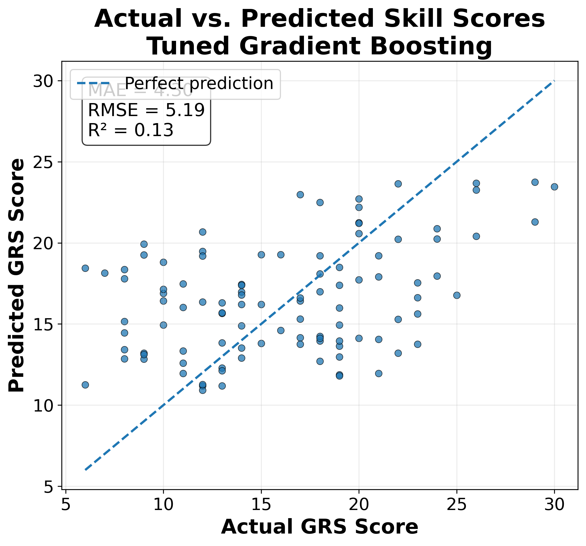
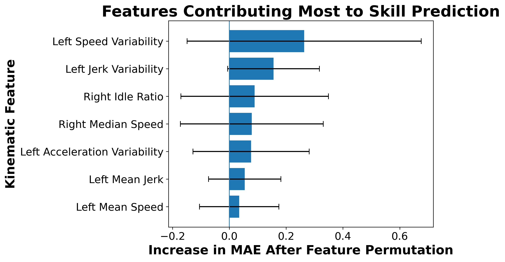
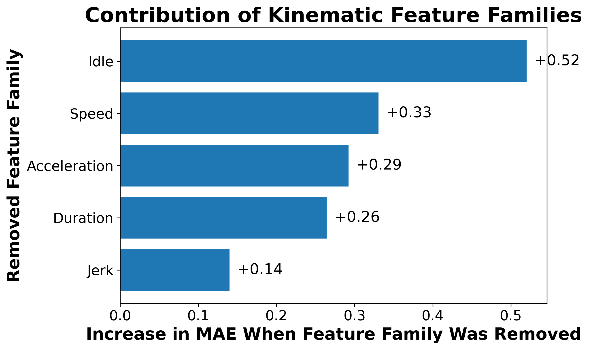

# Machine Learning-Based Human Skill Estimation for Assistive Robotics

**NSF REU SITE: HUMANS MOVE — University of Wyoming, Summer 2026**

This project investigates whether task-independent characteristics of human movement can be used to estimate human skill using machine learning, with the long-term goal of supporting adaptive shared-autonomy systems in assistive robotics.

Using kinematic data from the **JHU-ISI Gesture and Skill Assessment Working Set (JIGSAWS)**, I developed an end-to-end pipeline for processing robotic movement data, extracting interpretable motion features, analyzing their relationships with skill, and training regression models to estimate Global Rating Scale (GRS) scores.

---

## Research Question

**Can task-independent characteristics of human movement be used to estimate skill, and can machine learning models learn these relationships well enough to support future adaptive shared-autonomy systems?**

Many assistive robotic systems use fixed or manually selected levels of assistance. A system capable of estimating a user's skill from their movement could eventually adapt the amount or type of assistance it provides.

This project explores the **skill-estimation component** of that broader problem.

---

## Project Pipeline

```text
JIGSAWS Kinematic Data
        │
        ▼
Data Processing
        │
        ▼
Motion Feature Extraction
        │
        ├── Speed
        ├── Acceleration
        ├── Jerk
        ├── Idle Behavior
        └── Duration
        │
        ▼
Exploratory Data Analysis
        │
        ▼
Machine Learning Regression
        │
        ▼
Subject-Independent Evaluation
        │
        ▼
Estimated GRS Skill Score
```

---

## Dataset

The project uses the **JIGSAWS dataset**, which contains robotic surgical activity performed using the da Vinci Surgical System.

Three tasks were analyzed:

| Task           |  Trials |
| -------------- | ------: |
| Knot Tying     |      36 |
| Needle Passing |      28 |
| Suturing       |      39 |
| **Total**      | **103** |

Each trial contains time-series kinematic measurements describing the movements of the robotic system.

Although JIGSAWS originates from robot-assisted surgery, this project focuses on extracting **general characteristics of human motion** rather than task-specific surgical features.

### Skill Target

Skill is modeled as a regression problem using the **Global Rating Scale (GRS) Total Score** provided with JIGSAWS.

The total GRS score is derived from six assessment dimensions:

* Respect for tissue
* Suture/needle handling
* Time and motion
* Flow of operation
* Overall performance
* Quality of final product

Each component is scored from 1–5, producing a total score ranging from **6–30**.

---

## Feature Engineering

Rather than relying on task-specific information such as trajectory shape or path length, the project emphasizes movement characteristics that could potentially transfer across tasks.

Features were calculated separately for the left and right manipulators.

### Speed

For each side:

* Mean speed
* Median speed
* Maximum speed
* Speed standard deviation

The instantaneous 3D speed magnitude is calculated from the Cartesian velocity components.

### Acceleration

Acceleration is derived from changes in speed between consecutive samples.

Extracted statistics include:

* Mean acceleration magnitude
* Median acceleration magnitude
* Maximum acceleration magnitude
* Acceleration standard deviation

### Jerk

Jerk measures changes in acceleration and serves as a representation of movement smoothness.

Extracted statistics include:

* Mean jerk magnitude
* Median jerk magnitude
* Maximum jerk magnitude
* Jerk standard deviation

### Idle Behavior

Periods of very low movement are used to characterize pauses and inactivity.

Features include:

* Idle time
* Idle ratio

These are calculated independently for the left and right manipulators.

### Duration

The total duration of each trial is also included.

In total, **29 movement features** are used for modeling.

---

## Exploratory Data Analysis

Before model training, exploratory analysis was performed to understand the structure and behavior of the extracted feature dataset.

The analysis includes:

* Descriptive statistics
* Missing-value validation
* Feature distributions
* Outlier detection using the IQR rule
* Feature skewness
* Feature correlations
* Feature relationships with GRS
* Comparisons across skill levels
* Comparisons across tasks
* Comparisons across subjects

The resulting plots and reports are available under:

```text
results/eda/
```

---

## Machine Learning

The problem is formulated as **regression**, where the input is a set of extracted movement features and the output is the predicted GRS Total score.

Models evaluated include:

* Ridge Regression
* Elastic Net
* Random Forest
* Extra Trees
* Gradient Boosting
* Support Vector Regression

A Dummy Regressor was also evaluated as a baseline.

Selected nonlinear models were subsequently tuned to determine whether their performance could be improved.

---

## Subject-Independent Evaluation

A major concern when estimating human skill is **data leakage between trials from the same individual**.

If trials from one person appear in both the training and testing sets, a model may partially learn characteristics of that individual instead of learning movement patterns that generalize to unseen people.

For this reason, the models were evaluated using **subject-independent cross-validation**, holding out subjects during evaluation.

This creates a more difficult but more realistic test:

> Can the model estimate skill for a person it did not see during training?

---

# Results

## Model Comparison

Among the initial models, Random Forest achieved the lowest MAE:

| Model                     |   MAE |  RMSE |     R² |
| ------------------------- | ----: | ----: | -----: |
| Random Forest             | 4.345 | 5.367 |  0.073 |
| Extra Trees               | 4.424 | 5.463 |  0.039 |
| Gradient Boosting         | 4.750 | 5.975 | -0.149 |
| Dummy Regressor           | 4.907 | 5.786 | -0.078 |
| Support Vector Regression | 4.936 | 5.849 | -0.101 |
| Elastic Net               | 5.131 | 6.214 | -0.243 |
| Ridge Regression          | 5.595 | 6.758 | -0.470 |

After hyperparameter tuning, **Gradient Boosting produced the strongest overall performance**.

## Best Model

### Tuned Gradient Boosting

| Metric   |    Result |
| -------- | --------: |
| **MAE**  | **4.299** |
| **RMSE** | **5.193** |
| **R²**   | **0.132** |

The positive R² indicates that the model captures some relationship between the engineered movement features and GRS skill scores.

However, the relatively low R² also demonstrates that these summary-level kinematic features explain only a limited portion of the variation in skill.

This is an important result of the project: **human skill cannot be reliably represented by a small collection of simple movement statistics alone.**



---

## What Movement Characteristics Matter?

Permutation feature importance was used to investigate which individual movement characteristics contributed most strongly to the Gradient Boosting model.

The highest mean importance values included:

| Feature                              | Mean Importance |
| ------------------------------------ | --------------: |
| Left Speed Standard Deviation        |           0.263 |
| Left Jerk Standard Deviation         |           0.156 |
| Right Idle Ratio                     |           0.089 |
| Right Median Speed                   |           0.079 |
| Left Acceleration Standard Deviation |           0.077 |

These results suggest that **movement variability, smoothness, and idle behavior** contain useful information for distinguishing skill.



---

## Feature Family Ablation Study

To understand the contribution of broader movement characteristics, entire feature families were removed and the model was retrained.

| Features Removed    |       MAE | Change in MAE |
| ------------------- | --------: | ------------: |
| None — All Features | **4.299** |             — |
| Jerk                |     4.439 |        +3.25% |
| Duration            |     4.563 |        +6.14% |
| Acceleration        |     4.592 |        +6.80% |
| Speed               |     4.630 |        +7.69% |
| Idle Behavior       |     4.820 |   **+12.10%** |

Removing **idle features produced the largest deterioration in prediction accuracy**, followed by speed and acceleration features.

This suggests that pauses and periods of low movement may carry useful information about skill that is not completely represented by conventional speed or smoothness measurements.



---

# Key Findings

The experiments produced several important observations.

**1. Human skill is partially reflected in kinematic movement characteristics.**

The best model achieved a positive R² under subject-independent evaluation, suggesting that movement-derived features contain measurable information related to skill.

**2. Generalization to unseen individuals is difficult.**

Performance varied between held-out subjects, demonstrating the challenge of building a skill estimator that generalizes beyond the individuals represented during training.

**3. Idle behavior appears particularly informative.**

Removing idle-related features produced the largest increase in prediction error in the feature-family ablation experiment.

**4. Movement variability and smoothness are important individual predictors.**

Speed variability and jerk variability appeared among the strongest individual features.

**5. Simple summary features are not sufficient for highly accurate skill estimation.**

An R² of 0.132 indicates that most variation in GRS score remains unexplained by the current feature representation.

Rather than treating this as evidence that skill estimation is impossible, the result motivates richer representations of human movement.

---

# Limitations

Several limitations affect the conclusions that can be drawn from this study.

### Small Dataset

The dataset contains only 103 trials, limiting the amount of information available for model training.

### Limited Number of Subjects

Subject-independent evaluation significantly reduces the effective amount of training data in each fold.

### Surgical Domain

Although the selected features were designed to describe general movement characteristics, the underlying data originates from surgical tasks.

Additional datasets involving non-surgical human manipulation would be necessary to determine whether these relationships generalize to broader assistive-robotics settings.

### Handcrafted Summary Features

Each trial is reduced to summary statistics.

This removes much of the temporal structure of the original motion.

Two users could therefore produce similar averages while exhibiting very different movement patterns over time.

### GRS as Ground Truth

GRS was designed to evaluate surgical performance rather than general human motor skill.

Future work should investigate skill representations better suited to general human-robot interaction.

---

# Future Work

This project represents an initial step toward adaptive skill-aware robotic assistance.

Future directions include:

* Evaluating the feature framework on non-surgical manipulation datasets
* Collecting task-independent human manipulation data
* Exploring additional measures of coordination and movement efficiency
* Modeling temporal motion directly rather than relying only on trial-level statistics
* Investigating sequence models for kinematic data
* Developing task-normalized representations of skill
* Evaluating whether skill estimates can improve adaptive shared-control policies
* Moving from offline skill estimation toward real-time inference

The long-term objective is a system in which estimated human skill can become one input into an adaptive shared-autonomy framework:

```text
Human Motion
     │
     ▼
Skill Estimator
     │
     ▼
Estimated User Skill
     │
     ▼
Shared-Autonomy Controller
     │
     ▼
Adaptive Robotic Assistance
```

---

# Repository Structure

```text
JIGSAWS-DATA/
│
├── raw/
│   └── Original kinematic data
│
├── processed/
│   └── Processed trial-level kinematic data
│
├── features/
│   └── Extracted feature dataset
│
├── scripts/
│   ├── convert.py
│   ├── columns.py
│   ├── eda.py
│   ├── feature_extraction.py
│   ├── features_dataset_eda.py
│   └── validate_features.py
│
├── results/
│   ├── eda/
│   └── modeling/
│
├── documents/
│
└── model_training.ipynb
```

---

# Tools & Technologies

* Python
* pandas
* NumPy
* scikit-learn
* Matplotlib
* Jupyter Notebook
* Git / GitHub

---

# Research Context

This project was completed during the **NSF REU SITE: HUMANS MOVE** program at the **University of Wyoming** during Summer 2026.

The work was conducted in the **Robotics & Intelligent Systems Lab**.

### Researcher

**Abdurrahman Oyediran**

Computer Science
University of Southern Mississippi

### Mentorship

* Dr. Chao Jiang
* Umur Atan
* Varun Bharadwaj

---

# Acknowledgments

I would like to thank my mentors and the researchers involved in the HUMANS MOVE REU program for their guidance and feedback throughout the project.

This work uses the **JHU-ISI Gesture and Skill Assessment Working Set (JIGSAWS)**. Credit for the original dataset belongs to its creators and associated institutions.

---

# Disclaimer

This project is an undergraduate research prototype intended to investigate machine learning methods for human skill estimation.

The models presented here are **not clinical assessment systems** and should not be interpreted as validated measures of surgical competence.

---

## Project Status

**Summer 2026 REU research project — completed initial study.**

Ongoing directions include expanding the skill representation beyond handcrafted summary features and investigating its potential integration with adaptive shared-autonomy systems.
